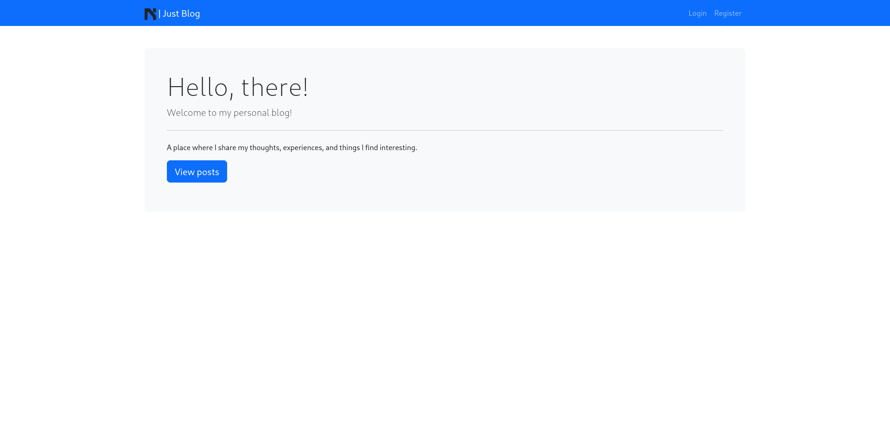
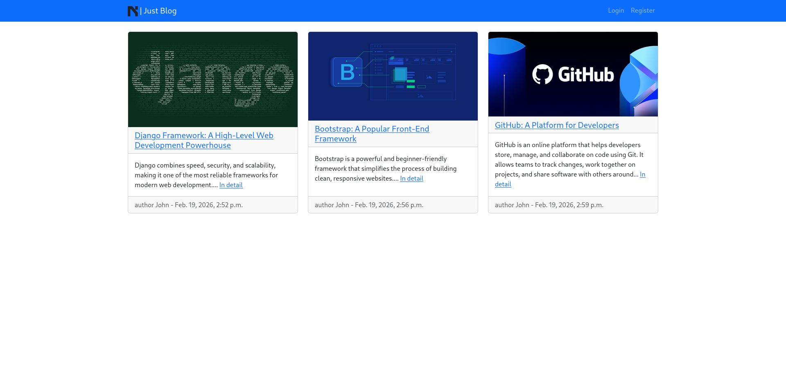
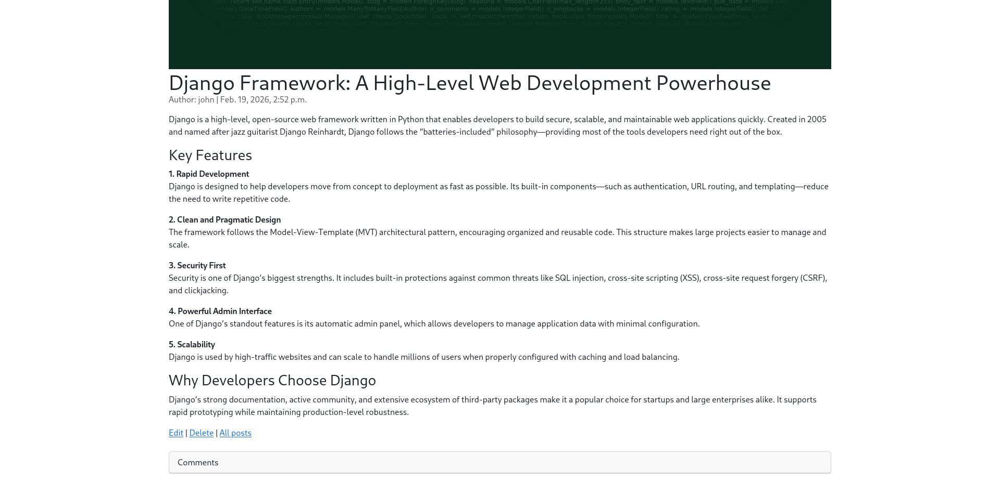
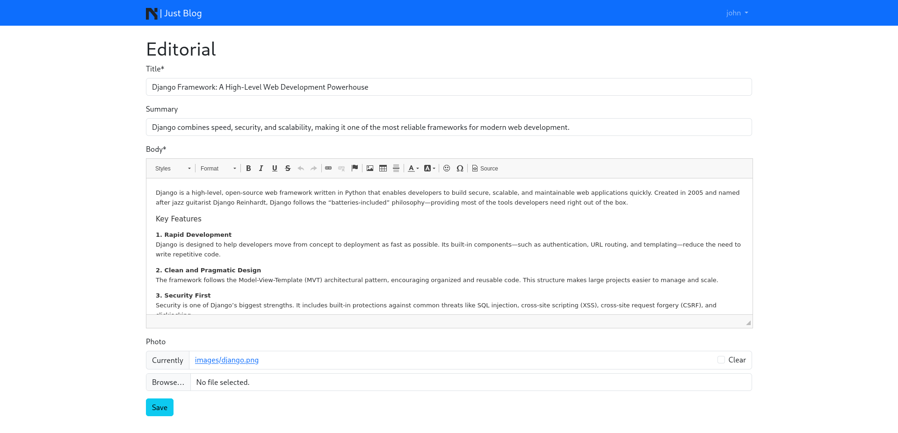
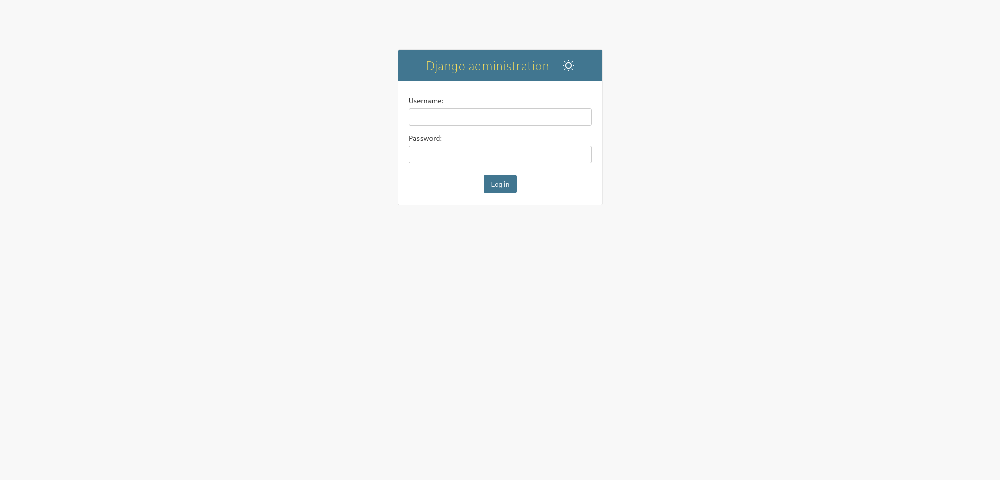
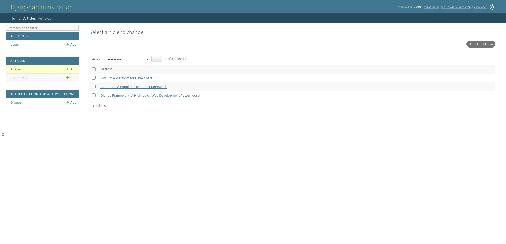

# Just Blog

A Django-based personal blog application with user authentication, allowing users to sign up, log in, and create, edit, and delete blog posts with rich text editing support.

## Pages

- **Home Page** (`/`) — Welcome page
- **Article List** (`/articles/`) — Displays all blog posts
- **Article Detail** (`/articles/<id>/`) — Full view of a single article with comments
- **Create Article** (`/articles/new/`) — Create a new blog post
- **Edit Article** (`/articles/<id>/edit/`) — Edit an existing post
- **Delete Article** (`/articles/<id>/delete/`) — Delete a post
- **Login** (`/accounts/login/`) — User login
- **Sign Up** (`/accounts/signup/`) — User registration
- **Admin Panel** (`/admin/`) — Django admin interface

## Tech Stack

- **Python** 3.13
- **Django** 6.0.2
- **SQLite3** — Database
- **CKEditor** — Rich text editor for article body
- **Pillow** — Image upload support
- **WhiteNoise** — Static file serving
- **crispy-forms + crispy-bootstrap5** — Form styling
- **Pipenv** — Dependency management

## Project Structure

```
newBlog/
├── config/                # Django project configuration
│   ├── settings.py
│   ├── urls.py
│   ├── wsgi.py
│   └── email_backend.py
├── articles/              # Articles app
│   ├── models.py          # Article and Comment models
│   ├── views.py           # List, Detail, Create, Update, Delete views
│   ├── urls.py
│   └── admin.py
├── accounts/              # User accounts app
│   ├── models.py          # CustomUser model
│   ├── views.py           # SignUpView
│   ├── forms.py
│   └── urls.py
├── pages/                 # Static pages app
│   ├── views.py           # HomePageView, 404/403 handlers
│   └── urls.py
├── templates/
│   ├── base.html                  # Base template
│   ├── home.html                  # Home page
│   ├── article_list.html          # All articles
│   ├── article_detail.html        # Article detail + comments
│   ├── article_new.html           # Create article form
│   ├── article_edit.html          # Edit article form
│   ├── article_delete.html        # Delete confirmation
│   ├── 404.html                   # Custom 404 page
│   ├── 403.html                   # Custom 403 page
│   └── registration/
│       ├── login.html             # Login page
│       ├── signup.html            # Sign up page
│       ├── password_change_form.html
│       ├── password_reset_form.html
│       └── ...
├── static/css/
│   └── main.css           # Custom styles
├── images/                # Screenshots
├── manage.py
├── Pipfile
└── db.sqlite3
```

## Getting Started

1. Clone the repository:
   ```bash
   git clone <repo-url>
   cd newBlog
   ```

2. Install dependencies:
   ```bash
   pipenv install
   ```

3. Activate the virtual environment:
   ```bash
   pipenv shell
   ```

4. Create a `.env` file in the project root:
   ```
   export DEBUG=True
   export SECRET_KEY=your-secret-key
   export DATABASE_URL=sqlite:///db.sqlite3
   ```

5. Apply migrations:
   ```bash
   python manage.py migrate
   ```

6. Create a superuser (to access admin):
   ```bash
   python manage.py createsuperuser
   ```

7. Run the development server:
   ```bash
   python manage.py runserver
   ```

8. Open http://127.0.0.1:8000/ in your browser.

## Screenshots

<details>
<summary>Home Page</summary>

</details>

<details>
<summary>Article List</summary>

</details>

<details>
<summary>Article Detail</summary>

</details>

<details>
<summary>Edit Article</summary>

</details>

<details>
<summary>Admin Login</summary>

</details>

<details>
<summary>Admin Panel</summary>

</details>
